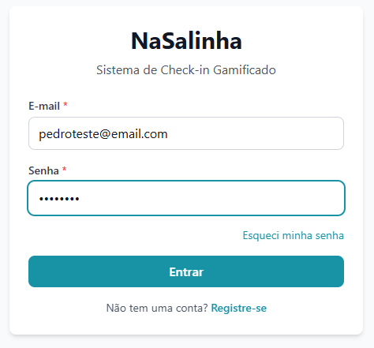
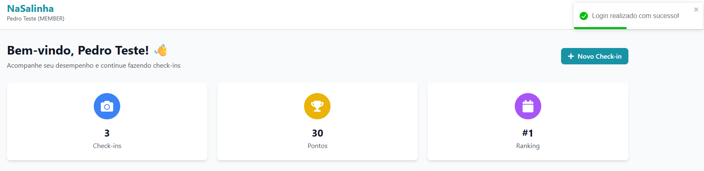
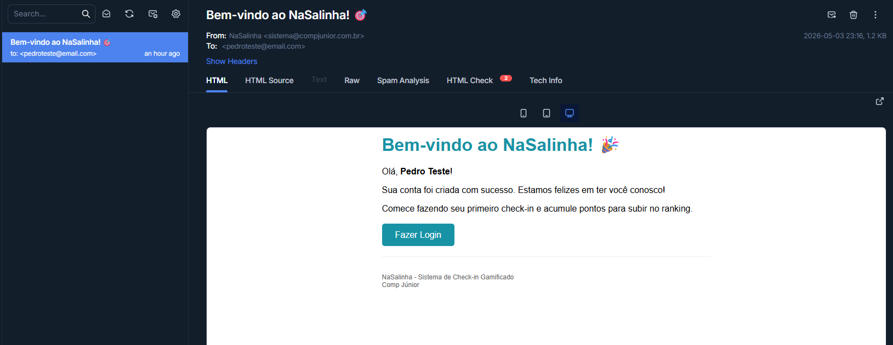
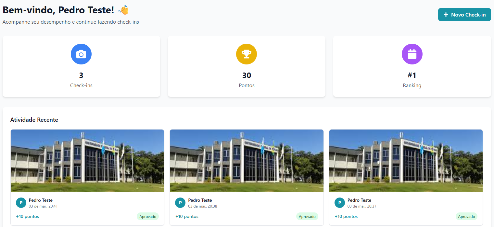
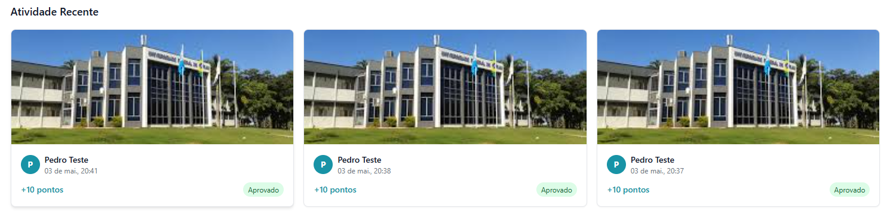

# 🐛 Bug Reports – Semana 4 (Funcionais)

**Desafio QA 2026 – Projeto NaSalinha**

## 📊 Resumo dos Bugs Encontrados

| ID | Título | Área | CT | Severidade | Status |
|----|--------|------|-----|------------|--------|
| BUG-01 | Login sem verificar e-mail | JWT | CT-03 | 🟠 Alta | Aberto |
| BUG-02 | Múltiplos check-ins no mesmo dia | Check-in | CT-08 | 🟠 Alta | Aberto |
| BUG-03 | Pontos sem aprovação do Admin | Pontos | CT-12 | 🟠 Alta | Aberto |

# BUG-01 – E-mail de verificação não é enviado + Login sem verificação

| Campo | Detalhe |
|-------|---------|
| Título | Sistema não envia e-mail de verificação e permite login mesmo sem conta verificada |
| Localização do Erro | Backend (envio de e-mail) / Backend (validação de status) |
| Severidade | 🟠 Alta |
| CT Relacionado | CT-03 |

---

## Passos para Reproduzir

1. Acessar a página de cadastro (http://localhost:3000/register)
2. Preencher Nome, E-mail e Senha válidos
3. Clicar em "Cadastrar"
4. Verificar caixa de entrada do Mailtrap
5. Constatar que **nenhum e-mail de verificação chegou**
6. Acessar a página de login (http://localhost:3000/login)
7. Inserir o e-mail e senha recém-cadastrados
8. Clicar em "Entrar"

---

## Resultado Esperado

- Sistema deve **enviar e-mail de verificação** com código único para o Mailtrap
- Sistema deve **bloquear o acesso** de contas não verificadas
- Exibir mensagem: *"Por favor, verifique sua conta para continuar"*
- Usuário NÃO deve ser redirecionado para a área logada
- Status da conta permanece PENDENTE

---

## Resultado Atual

- **Nenhum e-mail chega ao Mailtrap**
- Apesar disso, o login é realizado com **sucesso**
- Usuário é redirecionado para a área logada (dashboard)
- Nenhuma mensagem de erro é exibida
- O sistema trata a conta como se estivesse ATIVA

---

## Análise de Causa Raiz (RCA)

**Hipótese 1 – E-mail não enviado:**
O serviço de envio de e-mail (Nodemailer + Mailtrap) pode estar:
 
- a) **Código de envio ausente:** A função `sendVerificationEmail()` pode não estar sendo chamada após o registro
- b) **Erro silencioso:** O envio pode estar falhando mas o erro não está sendo logado (try/catch vazio)
- c) **Configuração de webhook:** O Mailtrap pode precisar de configuração adicional

**Hipótese 2 – Login sem verificação:**
Mesmo que o e-mail não seja enviado (ou não seja verificado), o endpoint `POST /api/auth/login` não está verificando o campo `status` do usuário antes de gerar o token JWT.

## Análise de Causa Raiz (RCA)

Hipótese: Falha no Backend (mais provável):
O endpoint POST /api/auth/login não está verificando o campo status do usuário antes de gerar o token JWT. O controller de autenticação provavelmente está validando apenas e-mail e senha (autenticação), mas não está checando se a conta está ativa (autorização). A validação if (user.status !== 'ACTIVE') está ausente ou comentada.

## Impacto

- 🚨 Dupla falha de segurança: E-mail não enviado + login permitido = verificação inútil
- 📧 Fluxo de verificação completamente quebrado: O sistema não envia o e-mail e também não exige a verificação
- 👻 Contas fantasmas: Qualquer pessoa pode criar infinitas contas sem e-mail real
- 🛡️ RF-01 e RF-02 violados: O sistema deveria enviar e-mail E bloquear contas não verificadas

## Evidência

- Print 1: 
- Print 2: 
- Print 3: 

# BUG-02 – Múltiplos check-ins permitidos no mesmo dia

| Campo | Detalhe |
|-------|---------|
| Título | Usuário consegue realizar dois check-ins consecutivos no mesmo dia |
| Localização do Erro | Backend (regra de negócio) / Frontend (falta de bloqueio) |
| Severidade | 🟠 Alta |
| CT Relacionado | CT-08 |

## Passos para Reproduzir

1. Fazer login com um usuário (Membro ou Trainee)
2. Acessar a página de check-in (http://localhost:3000/checkin)
3. Selecionar uma imagem válida (JPG/PNG)
4. Clicar em "Enviar Check-in" (primeiro check-in realizado com sucesso)
5. Imediatamente após, selecionar outra imagem válida
6. Clicar em "Enviar Check-in" novamente (segundo check-in)

## Resultado Esperado

- Sistema deve bloquear o segundo check-in
- Exibir mensagem: "Você já realizou um check-in hoje" ou "Aguarde 24 horas"
- Apenas um check-in por dia por usuário deve ser permitido (conforme RF-04 e RF-09)

## Resultado Atual

- O segundo check-in é registrado com sucesso
- Ambos aparecem na lista de check-ins do usuário
- Ambos ficam com status PENDENTE
- Nenhuma validação de intervalo de 24 horas é aplicada

## Análise de Causa Raiz (RCA)

Hipótese – Validação ausente no Backend:
O endpoint POST /api/checkins não está verificando se já existe um check-in do mesmo usuário nas últimas 24 horas. A verificação WHERE userId = X AND createdAt > (NOW() - INTERVAL 24 HOURS) está ausente no service ou controller de check-in.

## Impacto

- 🎮 Gamificação quebrada: Usuários podem farmar pontos fazendo múltiplos check-ins
- 📊 Ranking injusto: Quem abusa da falha sobe no ranking artificialmente
- 🏆 Integridade da competição comprometida: O sistema de temporadas perde o sentido

## Evidência

- Print 1: 

# BUG-03 – Pontos contabilizados sem aprovação do Admin

| Campo | Detalhe |
|-------|---------|
| Título | Check-in com status PENDENTE está contabilizando pontos no ranking automaticamente |
| Localização do Erro | Backend (Service de Pontuação) / Lógica de negócio |
| Severidade | 🟠 Alta |
| CT Relacionado | CT-12 |

## Passos para Reproduzir

1. Fazer login com um usuário Trainee
2. Realizar um check-in com foto válida
3. Não fazer login como Admin (não aprovar o check-in)
4. Acessar a página de ranking (http://localhost:3000/ranking)
5. Verificar a pontuação do usuário que fez o check-in

## Resultado Esperado

- O check-in deve ser criado com status **PENDENTE**
- Os pontos não devem ser contabilizados imediatamente
- O check-in deve aparecer na fila de moderação do Admin
- O Admin deve ter a opção de **Aprovar** ou **Rejeitar**
- Somente após a aprovação do Admin os pontos devem ser somados ao ranking (conforme RF-05 e RF-07)

## Resultado Atual

- O check-in já nasce com status **APROVADO**
- Não existe status PENDENTE visível em lugar nenhum
- Os pontos são contabilizados instantaneamente após o upload
- O usuário vê seus pontos aumentarem imediatamente após o check-in
- O painel de moderação do Admin não mostra check-ins pendentes para aprovar
- A função de aprovar/rejeitar do Admin é inútil porque tudo já chega aprovado

## Análise de Causa Raiz (RCA)

Hipótese – Gatilho errado na contagem de pontos:
O sistema está somando pontos no momento da criação do check-in (POST /api/checkins), e não no momento da aprovação (PUT /api/checkins/:id/approve). A função updatePoints() ou recalculateRanking() está sendo chamada no service de criação, quando deveria ser chamada apenas no service de aprovação.

## Impacto

- 🚨 Fluxo de moderação INEXISTENTE: O Admin não tem o que moderar, tudo já chega aprovado
- 🎮 Gamificação sem controle: Qualquer foto, mesmo imprópria ou inválida, gera pontos automaticamente
- 🏆 Ranking sem credibilidade: Não há filtro de qualidade, quantidade vence qualidade
- 🔓 RF-05 completamente violado: O sistema deveria atribuir status PENDENTE e permitir que apenas Admin altere para Aprovado/Rejeitado
- 🔓 RF-07 violado indiretamente: Os pontos são somados sem o controle de aprovação
- 👻 Admin sem função: O papel de Administrador perde uma de suas principais responsabilidades

## Evidência

- Print 1: 

## 📎 Distribuição de Severidade

| Severidade | Quantidade | Bugs |
|------------|------------|------|
| 🔴 Crítica | 0 | - |
| 🟠 Alta | 3 | BUG-01, BUG-02, BUG-03 |
| 🟡 Média | 0 | - |
| 🟢 Baixa | 0 | - |

> 📅 Semana 4 – Execução de Testes de Interface
> 
> Bugs encontrados durante testes funcionais no front-end.
> 
> Total de testes executados: 7
> 
> Pass: 4 | Fail: 3